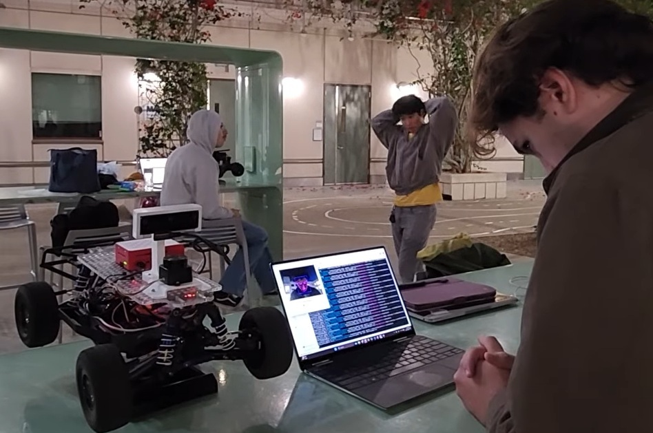
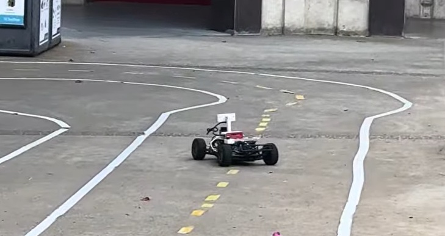

<h1 align = "center"> Head Turning Robot </h1>

<h2 align = "center"> MAE/ECE 148 Final Project Fall 26 </h2>
<h3 align = "center"> Team 13 </h2>

# Table of Contents
1. [Team Members](#Team-Members)
2. [Abstract](#Abstract)
3. [What We Promised](#What-We-Promised)
4. [Accomplishments](#Accomplishments)
5. [Demonstration](#Demonstration)
6. [Challenges](#Challenges)
7. [Robot Design](#Robot-Design)
8. [Circuit Diagram](#Circuit-Diagram)
9. [References](#References)
10. [Contacts](#Contacts)

# Team Members
- Evelyn M. - Computer Engineering
- Joseph W. - Computer Engineering
- Aden W. - Mechanical and Aerospace Engineering
- Omar C. - Extended Studies

# Abstract
The project's goal is to implement head-tracking gestures as directional movements and throttle control on our vehicle. We utilized the ROS2 framework with open-source head-tracking software to turn numerical head movement data into car movement commands. Our project hopes to create a fun, interactive game experience.

# What We Promised
**Must Haves**
- A direct correlation between head movement data (yaw and pitch) and the car's throttle and steering

**Nice to Have** 
- Integration of Lidar sensors for emergency stopping near obstacles
- Integration of our group's hand gesture detection model as an alternative for car movement control

# Accomplishments
- We successfully used UDP to connect AITrack, Opentrack, and our Pi to efficiently deliver numerical head movement data.
- We mapped pitch values to throttle and forward/backward driving direction.
  - We correlated a high positive pitch value with the backward direction and full throttle.
  - We correlated a mid positive pitch value with the backward direction and low throttle.
  - We correlated a high negative pitch value with the forward direction and full throttle.
  - We correlated a mid negative pitch value with the forward direction and low throttle.
  - We correlated mid-pitch values (when the head is centered) to give no throttle or direction
- We mapped yaw values to steering direction
  - We correlated a high positive yaw value with a sharp left turn.
  - We correlated a mid positive yaw value with a slight left turn.
  - We correlated a high negative yaw value with a sharp right turn.
  - We correlated a mid negative yaw value with a slight right turn.
  - We correlated mid yaw values (when the head is centered) to give no steer
# Demonstration
Steering Demo on stand:

Steering Demo live on track:

# Challenges
- Our first approach to steering had only two directions, hard left and hard right, making driving unnatural and incredibly difficult
   - We solved this problem by creating a system that mapped ranges of raw yaw degrees to specific servo steering values

# Robot Design

# Circuit Diagram

# References
- [opentrack](https://github.com/opentrack/opentrack?tab=readme-ov-file) 
- [opentrack releases](https://github.com/opentrack/opentrack/releases)
- [AITrack](https://github.com/AIRLegend/aitrack)
- [AITrack releases](https://github.com/AIRLegend/aitrack/releases)
# Contacts
- Evelyn M. - emaresmoreno@ucsd.edu
- Joseph W. - jwarzybokmckenney@ucsd.edu
- Aden W. - Adw010@ucsd.edu
- Omar C. - omarchoy@gmail.com

